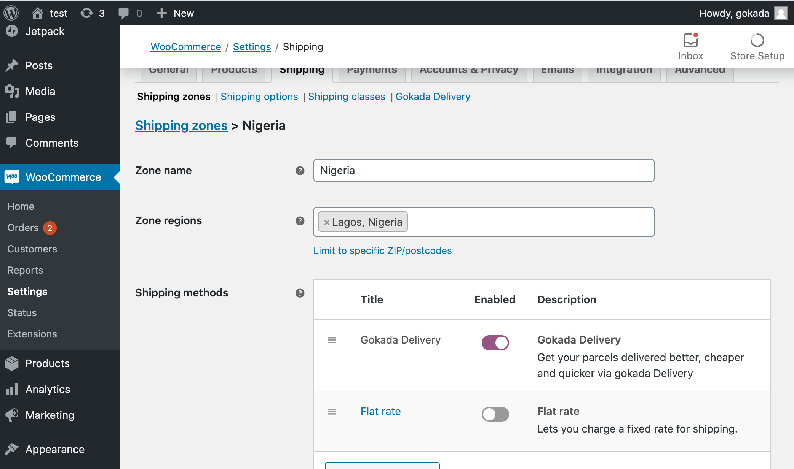
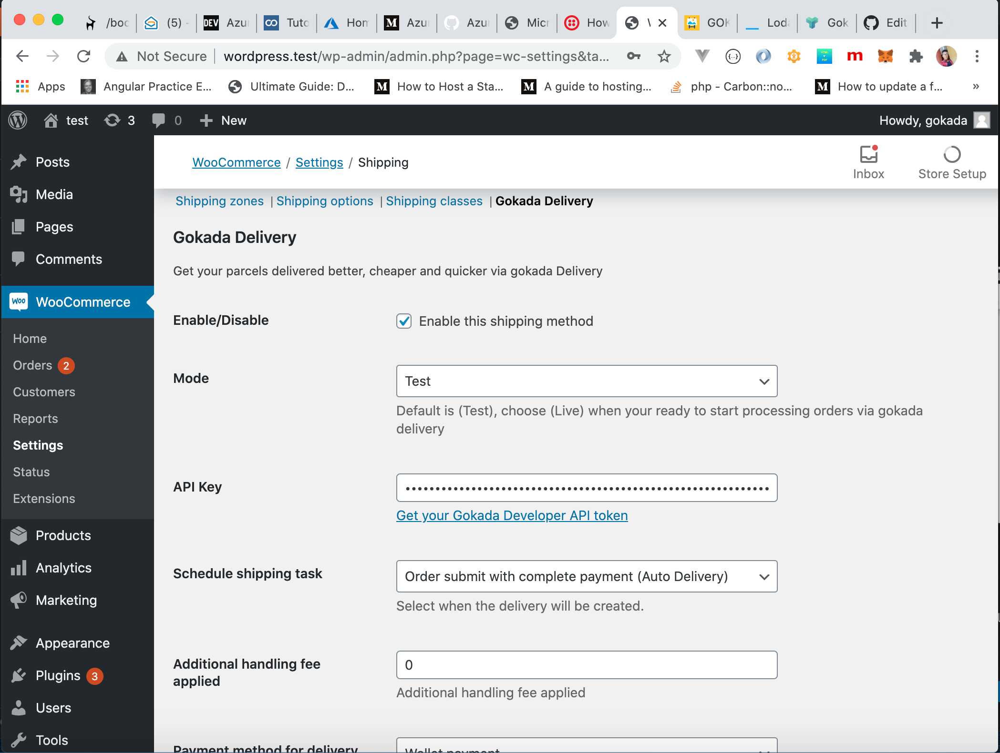
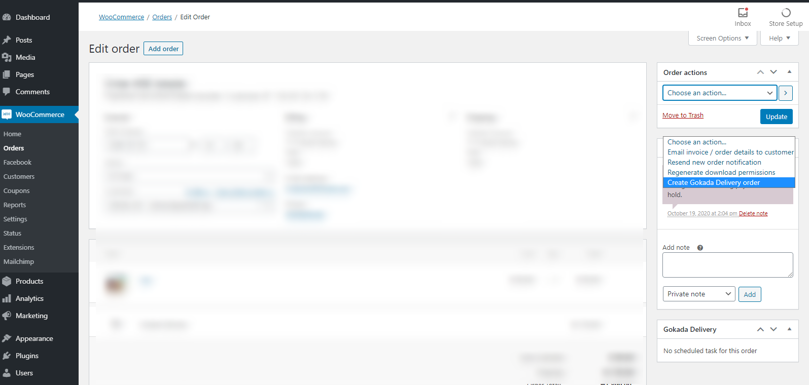

# Gokada Delivery for WooCommerce

**Minimum PHP version:** 5.4

**Minimum WordPress version:** 5.0

**Minimum Woocommerce version:** 4.0

## Description

This plugin allows you to create Gokada deliveries for your WooCommerce orders. To get an API key, visit <a href="https://business.gokada.ng" target="_blank">business.gokada.ng</a> and signup for a Gokada Developer account. 

### Note

Gokada currently serves only **Lagos, Nigeria**.

### Features

- **Create deliveries**: Get access to hundreds of qualified pilots and deliver anywhere in Lagos
- **Schedule tasks**: Choose whether to schedule delivery immediately payment is made, at a time of your choice, or manually via the Woocommerce dashboard
- **Tracking**: Get real-time tracking links for you and your customers

## Installation

### Manual Installation

1.  Download the latest version of the plugin in zip format <a href="https://github.com/gokada/gokada-wordpress/archive/main.zip">here</a>
2.  Login to your WordPress Admin. Click on **Plugins > Add New** from the left-hand menu.
3.  Click on the "Upload" option, then click "Choose File" to select the zip file from your computer. Once selected, press "OK" and press the "Install Now" button.
4.  Activate the plugin.
5.  Open the settings page for WooCommerce on **WooCommerce > Settings** and click the "Shipping" tab.
6.  Add a new Shipping Zone, with the `Zone Region` set as __Lagos__. Click on `Add Shipping Method` and select __Gokada Delivery__ from the list of options.

    

7.  Configure your **Gokada Delivery** settings. See below for details.

### Configure the plugin

To configure the plugin, go to **WooCommerce > Settings** from the left-hand menu, then click **Shipping** from the top tab. You will see **Gokada Delivery** as part of the available Shipping Options. Click on it to configure the plugin.

- **Enable/Disable** - check the box to enable the Gokada Delivery shipping method.
- **Mode** - Select whether to enable test or live mode.
- **Test API Key** - Enter your test API Key here.
- **Live API Key** - Enter your live API Key here.
- **Schedule Shipping Task** - Choose when Gokada orders are created.
- **Additional Handling Fee** - Add an additional handling fee to the delivery total.
- **Pickup Delay Time** - Enter a delay for auto-created Gokada deliveries.
- **Pickup Schedule Time** - Enter a daily time for scheduled Gokada deliveries.
- **Pickup Country** - Your store's country __(Default: Nigeria)__.
- **Pickup State** - Your store's state __(Default: Lagos)__.
- **Pickup City** - Your store's city.
- **Pickup Address** - Your store's address.
- **Sender Name** - Your store's name.
- **Sender Phone Number** - Your store's phone number.
- **Sender Email** - Your store's email address.
- Click on **Save Changes**.

    

#### Note

Please ensure `Pickup City`, `Pickup Address` and `Sender Phone Number` fields are filled and correct, to avoid unwanted errors.

## Usage

### Manually creating orders

To manually create Gokada Delivery orders if you have selected this option, go to the Woocommerce Orders page on **WooCommerce > Orders** and click on the order to the Detail page. On the top-right side of the page, select "Create Gokada Delivery order" from **Order Actions** and click the **>** button next to it.

 
    

## Frequently Asked Questions

Visit <a href="https://www.gokada.ng/faq" target="_blank">gokada.ng/faq</a>.

## Changelog ##

### 1.3.1 - July, 2021 = 
* Update API base URL
### 1.3 - February, 2021 = 
* Remove lat/lng API dependency

### 1.2.1 - November, 2020 =
* Tweak: Use billing_city to store delivery latitude/longitude
### 1.2 - November, 2020 =
* Get autocomplete results on address fields
* Modify Scheduled delivery as a standalone order method
 
### 1.1 - October, 2020 =
* Different fields for Test and Live API keys
* Create orders manually from Order page
* Scheduled orders are now created once the order status is "Processing"
* Display errors on order page
* Allow Retry of failed orders
* Allow Bulk Order creation on manual submit mode
 
### 1.0 - October, 2020 =
* First release